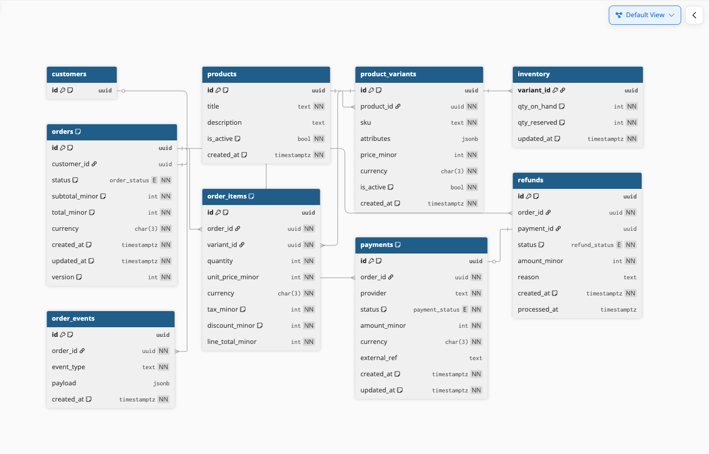

# Squadio OMS (Order Management System)

Create Order management system with catalog and basic operation for the orders

API endpoint here https://.postman.co/workspace/My-Workspace~742ac3e4-1d11-4f96-8cb3-3f1da014b6e6/collection/42564191-13b670f5-e6e0-4de8-967c-06c0535f777c?action=share&creator=42564191

## Database Design


**basically we have** 

To manage the order data
- Order
- Order Item
- Payment
- Refund

To show a timeline for the order we store every event
- Order Event

And `Products` with `variations` and `Inventory`


## Installation

app is fully dockerized so you just need to have docker and run the below command

```bash
make run
```


## Whats next

Not done because i got very little time (1 day only)

- [ ] idempotent for the refund endpoint so it can't be run multiple times and we lose money
- [ ] Transactions for every db action to rollback on failure
- [ ] Event store , so each order have a visual timeline and we know every thing happened when and by who
- [ ] User and authentication
- [ ] Reports for the admin

### Events timeline sample


Events with payload

•	order_created → { "customer_id": "...", "currency":"EGP" }
•	item_added → { "variant_id":"...", "qty":2, "unit_price_minor":1200, "line_total_minor":2400 }
•	item_removed → { "variant_id":"...", "qty":1 }
•	coupon_applied → { "code":"WELCOME10", "discount_minor":500 }
•	status_changed → { "from":"draft", "to":"pending_payment" }
•	inventory_reserved → { "items":[{"variant_id":"...","qty":2}], "reserved":true }
•	payment_authorized → { "payment_id":"...","amount_minor":2900,"provider":"stripe" }
•	payment_captured → { "payment_id":"...","amount_minor":2900 }
•	shipment_created → { "shipment_id":"...","carrier":"DHL","tracking":"XYZ" }
•	refund_processed → { "refund_id":"...","amount_minor":1000,"reason":"partial_return" }
